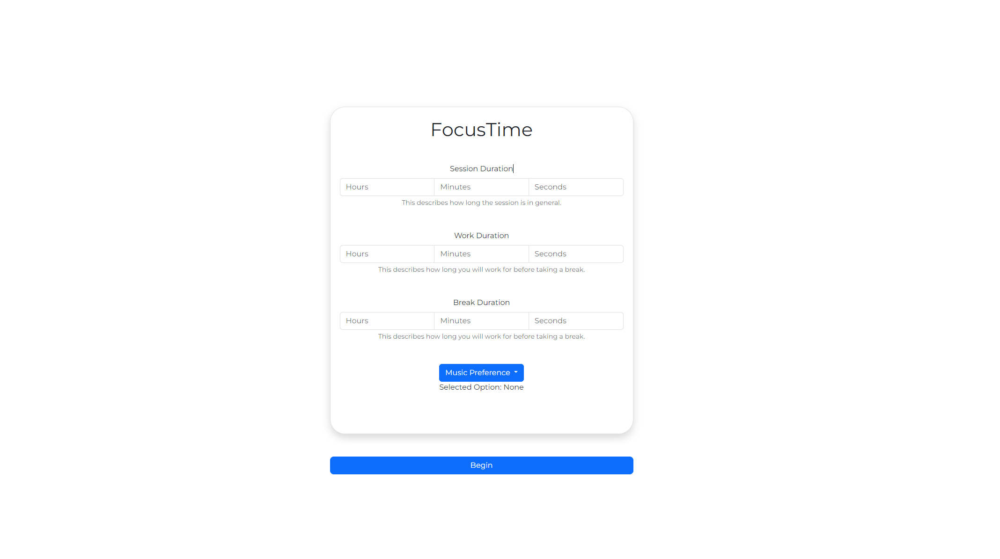

# FocusTime

## Introducing FocusTime: Boost Your Productivity and Stay Focused!

FocusTime is a powerful productivity tool designed to help individuals enhance their focus and optimize their time management. With its intuitive interface and feature-rich functionality, FocusTime empowers users to stay on track, eliminate distractions, and achieve their goals efficiently. Whether you're a student, professional, or anyone seeking improved productivity, FocusTime is your ultimate companion.

### Key Features:

1. **Task Tracking and Management**: FocusTime provides a user-friendly task management system that allows you to organize your activities effectively. Create tasks, set priorities, and track progress effortlessly.

2. **Pomodoro Technique Integration**: Incorporating the renowned Pomodoro Technique, FocusTime helps you work in focused bursts and take regular breaks to maintain optimal productivity levels. Increase your concentration and accomplish more with this proven technique.

3. **Website and App Blocking**: Eliminate distractions by blocking websites and applications that tend to derail your focus. Set specific time intervals or configure recurring blocks to ensure uninterrupted workflow.

4. **Customizable Work Sessions**: Tailor your work sessions to suit your preferences. Adjust the duration of focused work periods and breaks according to your needs, allowing for a personalized and flexible productivity experience.

5. **Progress Insights and Analytics**: Gain valuable insights into your productivity patterns and track your progress over time. FocusTime generates visual reports and statistics, enabling you to identify areas for improvement and celebrate achievements.

6. **Notifications and Reminders**: Stay on top of your tasks and schedule with customizable notifications and reminders. FocusTime ensures that you never miss an important deadline or forget to take essential breaks.

7. **Cross-Platform Compatibility**: Access FocusTime on various platforms and devices, including web browsers, desktop applications, and mobile apps. Seamlessly switch between devices and stay productive wherever you go.

Boost your productivity, achieve your goals, and reclaim control over your time with FocusTime. Experience the power of focused work and unlock your full potential.

### Get Started:

To get started with FocusTime, follow these simple steps:

1. Visit our website [www.focustime.com](https://www.focustime.com) and sign up for a free account.
2. Download the FocusTime app for your preferred platform or access it directly from your web browser.
3. Set up your task list, configure your work sessions, and customize your focus preferences.
4. Start a focused work session, eliminate distractions, and watch your productivity soar.

Don't let distractions hinder your success. Choose FocusTime and take control of your time, one focused session at a time.

> "FocusTime: Unleash Your Productivity Potential!"
